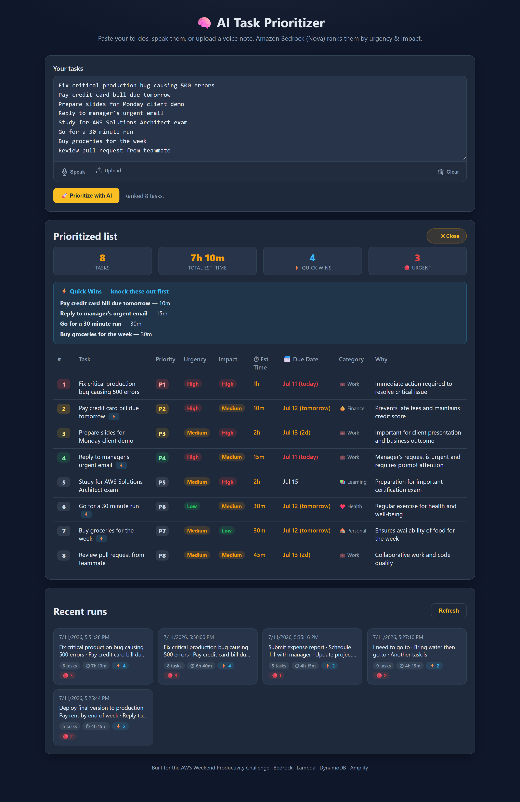
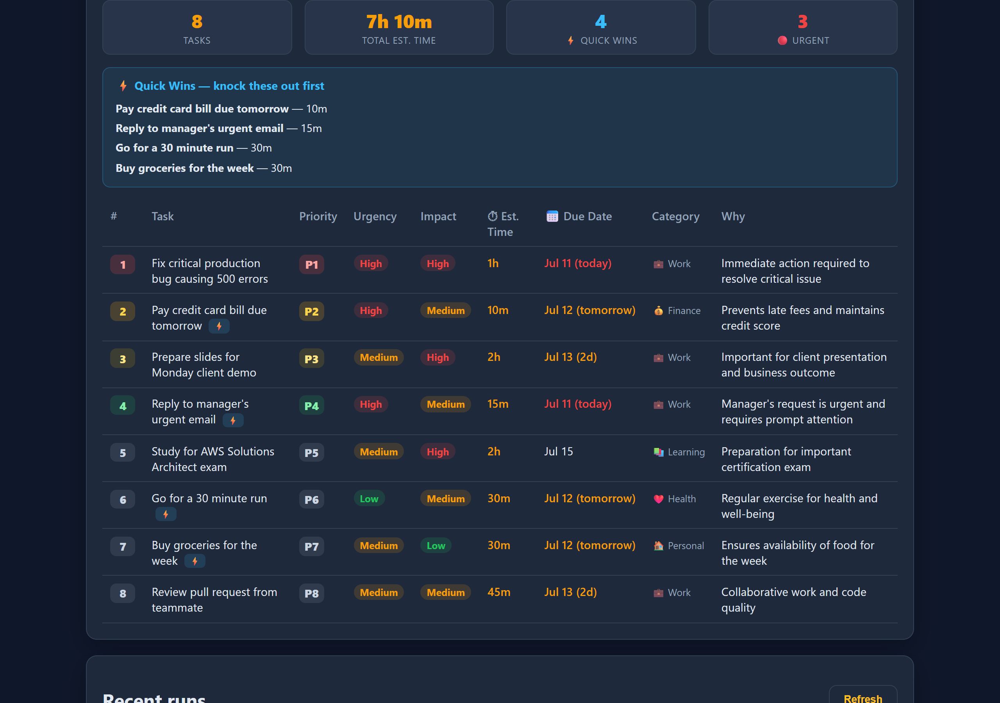
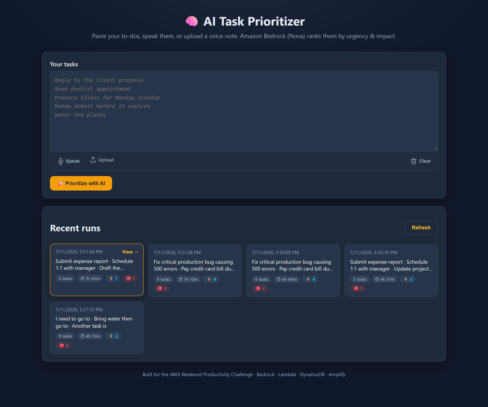
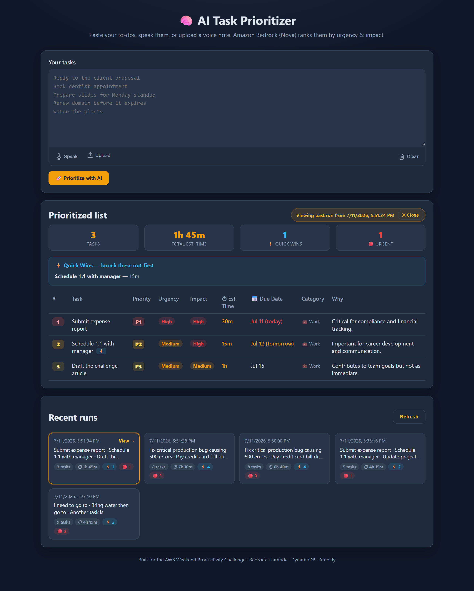

# Weekend Productivity Challenge: AI Task Prioritizer – Intelligent To‑Do Ranking with Amazon Bedrock and AWS Serverless

Learn how I built **AI Task Prioritizer**, an AI-powered productivity assistant using **Amazon Bedrock (Nova Lite)**, **AWS Lambda**, **Amazon API Gateway**, **Amazon DynamoDB**, **AWS Amplify Hosting**, and **AWS SAM / CloudFormation**. This article walks through the vision, architecture, implementation, deployment, and lessons learned while shipping a fully serverless AWS application for the Weekend Productivity Challenge.

**Author:** Mahantesh Hiremath · mahanteshimath@gmail.com

**Tag:** #productivity

**🔗 Live application:** https://main.d2ncn9d88sa351.amplifyapp.com

---

## Introduction

Productivity isn't about doing *more* — it's about doing the **right things at the right time**.

Most of us start the day with a growing to-do list, but deciding *where to begin* often takes
longer than the work itself. High-impact tasks get buried under busywork, deadlines creep up
unnoticed, and every context switch chips away at focus. Traditional task managers are excellent
at *storing* tasks, but they rarely help you answer the only question that matters in the
morning: **what should I do first?**

That gap inspired **AI Task Prioritizer** — an AI assistant that turns a messy list into an
intelligent, time-boxed execution plan. You provide your tasks (by typing, speaking, or uploading
a voice note) and the app uses **Amazon Bedrock** to judge urgency and impact, estimate how long
each task will take, suggest due dates, categorize the work, and flag quick wins — all in about
three seconds.

The entire solution runs on a fully serverless AWS architecture and is provisioned as code with
**AWS SAM / CloudFormation**, making it scalable, cost-effective, and easy to reproduce.

---

## Vision & What the App Does

AI Task Prioritizer is designed to act as a personal productivity coach, not just another to-do
list. You enter the tasks you need to finish, and instead of sorting them alphabetically or by
due date, the app sends them to **Amazon Bedrock**, which evaluates the whole workload and returns
an optimized plan.

For every task, the app returns a rich, decision-ready breakdown:

- **Priority** — P1–P5, where P1 means "do this first"
- **Urgency** and **Impact** — rated low / medium / high
- **Estimated time** to complete, so you can fit work into the time you actually have
- **Suggested due date**, color-coded for *today / tomorrow / overdue*
- **Category** — work, personal, health, finance, learning, or admin (with an icon)
- **Quick-win flag** for anything ≤15 minutes that still has real impact
- A one-sentence **reason** explaining the ranking

A **summary dashboard** shows the total task count, total estimated effort, number of quick wins,
and how many items are urgent — the whole day at a glance. A dedicated **Quick Wins** panel
surfaces the fast, high-value tasks so you can build momentum immediately.

Every analysis is stored in **Amazon DynamoDB**. The **Recent runs** section shows each past
session as a clickable tile with its stats; click one and the full breakdown re-opens exactly as
it was, so you can revisit previous plans and see how your week actually unfolded.

Rather than creating another place to *store* tasks, AI Task Prioritizer helps you make better
decisions about **how to spend your time**.

---

## Features

- 🤖 **AI-powered task prioritization** with transparent reasoning
- ⏱️ **Effort estimates** and a total-time summary
- 📅 **Smart, date-aware due dates** relative to today
- 🏷️ **Automatic categorization** into six life/work areas
- ⚡ **Quick-win detection** to build momentum fast
- 🎙️ **Voice input** — live speech-to-text or voice-note upload
- 🕘 **Historical tracking** with clickable, re-openable past runs
- 📊 **Summary dashboard** for at-a-glance planning
- ☁️ **Fully serverless AWS architecture**
- 🧱 **Infrastructure as Code** with AWS SAM / CloudFormation
- 🎨 **Fast, responsive, framework-free UI** (zero build step)

---

## How I Built It

### Choosing a Serverless Architecture

From the start I wanted the app to be entirely serverless. Productivity tools have unpredictable,
bursty usage, so managed AWS services let it scale automatically while keeping operational
overhead — and cost — near zero.

The **frontend** is intentionally plain **HTML, CSS, and JavaScript** — no framework and no build
step, so it loads instantly. It's hosted on **AWS Amplify Hosting** over HTTPS. The **backend** is
a single **AWS Lambda** function written in **Python 3.12** (arm64), fronted by an **Amazon API
Gateway HTTP API** with CORS. Two routes power the whole app: `POST /prioritize` and
`GET /history`.

### AI-Powered Prioritization

The heart of the app is **Amazon Bedrock**, using the **Amazon Nova Lite** model. When a request
arrives, the Lambda injects the current date and a strict system prompt, then asks Nova to return
**only** structured JSON — an array of tasks, each with `priority`, `urgency`, `impact`,
`estimatedMinutes`, `suggestedDueDate`, `category`, `quickWin`, and `reasoning`.

Returning structured JSON made it trivial to render results in the UI and to persist them for
later. Low temperature keeps the rankings stable and consistent rather than creative.

### Data Storage

Every completed analysis is written to **Amazon DynamoDB** with a timestamp. A simple
partition/sort key design (`pk = "history"`, sorted by `createdAt`) lets me fetch the most recent
runs with `ScanIndexForward=False`. On-demand billing means I never think about capacity, and the
History view reads straight from the table.

### Infrastructure as Code & Deployment

All backend resources are declared in a single **AWS SAM** template and deployed with
**CloudFormation** through the **AWS CLI** — `aws cloudformation package` uploads the Lambda
artifact to S3, and `aws cloudformation deploy` stands up the function, HTTP API, DynamoDB table,
and a least-privilege IAM role in a couple of minutes, printing the API URL as an output.

For the frontend I used **Amplify's programmatic deploy path**: `create-deployment` returns a
presigned URL, I upload a zip of the static assets, then `start-deployment` publishes it live.
This CLI-first workflow makes the whole pipeline scriptable and reproducible end to end. To
iterate quickly I also wrote a small pure-Python dev server that serves the frontend and calls
Bedrock directly — no deployment needed while developing.

---

## AWS Services Used / Architecture Overview

| AWS Service | Purpose |
|---|---|
| **Amazon Bedrock (Nova Lite)** | AI-powered ranking, reasoning, and productivity insights |
| **AWS Lambda** | Runs the Python backend without server management |
| **Amazon API Gateway (HTTP API)** | Securely exposes the REST endpoints with CORS |
| **Amazon DynamoDB** | Stores historical prioritization runs (on-demand) |
| **AWS Amplify Hosting** | Hosts and globally serves the static frontend |
| **AWS SAM + CloudFormation** | Infrastructure as Code, deployed via the AWS CLI |
| **AWS IAM** | Least-privilege permissions (scoped `bedrock:InvokeModel` + DynamoDB CRUD) |

**Architecture**

```
Browser · AWS Amplify Hosting (static HTML / CSS / JS)
   │  POST /prioritize · GET /history   (HTTPS + CORS)
   ▼
Amazon API Gateway (HTTP API)
   ▼
AWS Lambda (Python 3.12, arm64)
   ├─ Amazon Bedrock  → Nova Lite   (ranking + reasoning)
   └─ Amazon DynamoDB → save & list run history
```

Every component sits comfortably within the **AWS Free Tier** for personal use.

---

## Screenshots

**AI-ranked results — priority, urgency, impact, time, due date, category, and reasoning**



**Summary dashboard + Quick Wins panel**



**Clickable run history — every prioritization is saved**



**Re-open any past run in full**



---

## Challenges

The biggest technical challenge was getting the model to **consistently return valid JSON** the
frontend could render. Early responses sometimes wrapped the answer in explanatory prose or
Markdown code fences, which broke `json.loads`. I solved it two ways: a strict system prompt that
forbids prose, plus a defensive extractor in the Lambda that pulls the first `{ ... }` block from
the response and strips any fences before parsing. Adding date-aware due dates meant injecting
**today's date** into the prompt so suggestions are always relative to *now*.

On the delivery side, building a clean **CLI-only deployment pipeline** — CloudFormation package
and deploy for the backend, plus Amplify's presigned-URL zip upload for the frontend — took some
iteration to get right, but the payoff is a fully scriptable, reproducible ship process with no
manual console steps.

---

## What I Learned

Building this app gave me hands-on experience across several AWS services and cloud-native
patterns. The most valuable lessons:

- Treating an **LLM as a structured-data API**, not a chat partner — a strict schema plus
  defensive parsing is the difference between a demo and something you'd rely on daily.
- Deploying and iterating on **Amazon Bedrock** with a scoped IAM policy.
- Wiring **Lambda + API Gateway + DynamoDB** together cleanly with one readable SAM template.
- Shipping a **fully CLI-driven pipeline** — CloudFormation for the backend, Amplify's deploy API
  for the frontend — which is fast, scriptable, and reproducible.
- Applying **least-privilege IAM** and basic web security (HTML-escaping user input to prevent XSS).

Most importantly, I was reminded that **"start simple" is real advice**: one focused tool —
deployed, working, and genuinely useful — beats an ambitious one that never ships.

---

## Project Links

- **Live application:** https://main.d2ncn9d88sa351.amplifyapp.com
- **Source code:** https://github.com/mahanteshimath/AI-Task-Prioritizer 

---

## Future Improvements

AI Task Prioritizer has a solid foundation, with several enhancements planned:

- Server-side transcription with **Amazon Transcribe** (Safari + offline audio support)
- User accounts and per-user history with **Amazon Cognito**
- Calendar export (`.ics`) generated from suggested due dates
- Weekly productivity analytics and trends
- Drag-and-drop manual reordering with AI re-scoring
- Recurring-task detection and reminders

---

## Final Thoughts

Building AI Task Prioritizer for the AWS Weekend Productivity Challenge was a great opportunity to
explore how generative AI and serverless technologies combine to solve a practical, everyday
problem. By pairing **Amazon Bedrock** with **AWS Lambda**, **API Gateway**, **DynamoDB**,
**Amplify Hosting**, and **SAM / CloudFormation**, I shipped a scalable, production-ready app that
helps people prioritize their work and make smarter decisions about their time.

This project reinforced how powerful managed AWS services are for rapidly building AI-enabled
applications — letting builders focus on solving user problems instead of managing infrastructure.
I hope it inspires other builders to experiment with Amazon Bedrock and create practical,
AI-powered productivity tools.

Thank you for reading!

---

*Built with ❤️ by Mahantesh Hiremath · mahanteshimath@gmail.com*
