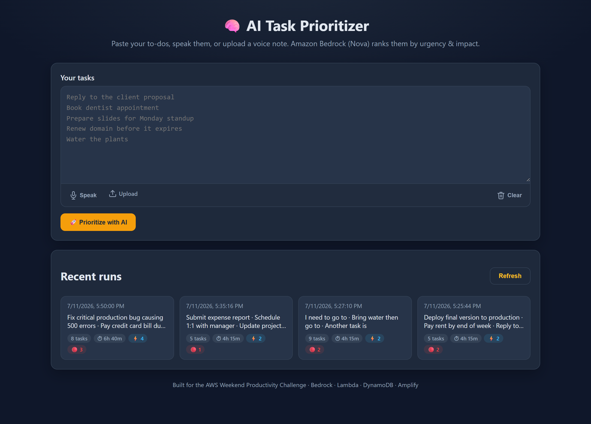

<div align="center">

# 🧠 AI Task Prioritizer

### Turn a messy to-do list into an AI-ranked action plan — powered by Amazon Bedrock.

Paste, **speak**, or upload a voice note of your tasks. Amazon Bedrock (Nova) ranks every
task by **urgency** and **impact**, estimates the **time** each will take, suggests a
**due date**, tags a **category**, flags **quick wins**, and explains its reasoning — then
saves every run so you can revisit it later.

Built for the **AWS Weekend Productivity Challenge**.

[](https://aws.amazon.com/)
[](https://aws.amazon.com/bedrock/)
[](https://aws.amazon.com/lambda/)
[](https://www.python.org/)
[](#-license)

**🔗 Live demo:** https://main.d2ncn9d88sa351.amplifyapp.com

</div>

---

## 📑 Table of contents

- [Features](#-features)
- [Live architecture](#-live-architecture)
- [Tech stack](#-tech-stack)
- [Screenshots](#-screenshots)
- [Repository layout](#-repository-layout)
- [Quick start (local)](#-quick-start-local)
- [Deploy to AWS with the CLI (no Git required)](#-deploy-to-aws-with-the-cli-no-git-required)
- [API reference](#-api-reference)
- [How the AI ranking works](#-how-the-ai-ranking-works)
- [Configuration](#-configuration)
- [Security notes](#-security-notes)
- [Cost](#-cost)
- [Cleanup](#-cleanup)
- [Roadmap](#-roadmap)
- [Contributing](#-contributing)
- [License](#-license)
- [Author](#-author)

---

## ✨ Features

| Capability | Description |
|---|---|
| 🤖 **AI prioritization** | Amazon Bedrock (Nova Lite) ranks tasks `P1`–`P5` with urgency, impact, and one-line reasoning. |
| ⏱️ **Time estimates** | Every task gets a realistic time-to-complete estimate; a summary bar shows total effort. |
| 📅 **Smart due dates** | Suggested due dates relative to today, color-coded for *today / tomorrow / overdue*. |
| 🏷️ **Auto categories** | Tasks are tagged `work`, `personal`, `health`, `finance`, `learning`, or `admin`. |
| ⚡ **Quick wins** | Highlights tasks ≤15 min with medium+ impact so you can build momentum fast. |
| 📊 **Summary dashboard** | At-a-glance totals: task count, total estimated time, quick wins, urgent items. |
| 🎙️ **Voice input** | Speak tasks with the Web Speech API (live mic) or upload a voice note. |
| 🕘 **Run history** | Every prioritization is saved. Click any past run tile to re-open its full breakdown. |
| 🎨 **Polished dark UI** | Responsive, accessible, zero-framework HTML/CSS/JS — loads instantly. |

---

## 🏗️ Live architecture

```
┌──────────────────────────────────────────────────────────────┐
│  Browser  ·  AWS Amplify Hosting (static HTML / CSS / JS)      │
│  main.d2ncn9d88sa351.amplifyapp.com                            │
└───────────────┬──────────────────────────────────────────────┘
                │  POST /prioritize   GET /history   (HTTPS + CORS)
                ▼
┌──────────────────────────────────────────────────────────────┐
│  Amazon API Gateway  ·  HTTP API                              │
│  vdn643918i.execute-api.us-east-1.amazonaws.com               │
└───────────────┬──────────────────────────────────────────────┘
                ▼
┌──────────────────────────────────────────────────────────────┐
│  AWS Lambda  ·  Python 3.12  ·  arm64                         │
│    ├── Amazon Bedrock  → Nova Lite   (ranking + reasoning)     │
│    └── Amazon DynamoDB → save + list run history              │
└──────────────────────────────────────────────────────────────┘
```

All infrastructure is declared as code in [`backend/template.yaml`](backend/template.yaml)
(AWS SAM / CloudFormation) and deployed entirely from the **AWS CLI** — no Git push needed.

---

## 🧰 Tech stack

| Layer | Technology |
|---|---|
| **AI model** | Amazon Bedrock — `amazon.nova-lite-v1:0` |
| **Compute** | AWS Lambda (Python 3.12, arm64) |
| **API** | Amazon API Gateway (HTTP API) with CORS |
| **Data** | Amazon DynamoDB (on-demand billing) |
| **Hosting** | AWS Amplify Hosting (manual/CLI deploy) |
| **IaC** | AWS SAM + CloudFormation |
| **Frontend** | Vanilla HTML5, CSS3, JavaScript (no build step) |
| **Voice** | Web Speech API (`SpeechRecognition`) + `AudioContext` |
| **Local dev** | Pure-Python dev server (`backend/local_server.py`) — no SAM required |

---

## 📸 Screenshots

<div align="center">

**Home — type, speak, or upload your tasks**



**AI-ranked results — priority, urgency, impact, time, due date, category & reasoning**


**Summary dashboard + Quick Wins panel**


**Clickable run history**


**Re-open any past run in full**


</div>

---

## 📂 Repository layout

```
BUILDER/
├── backend/
│   ├── template.yaml        # SAM: Lambda + HTTP API + DynamoDB + IAM (Bedrock invoke)
│   ├── src/
│   │   ├── app.py           # Lambda handler: /prioritize (Bedrock + save) and /history
│   │   └── requirements.txt # (boto3 is bundled in the Lambda runtime)
│   ├── local_server.py      # Local dev server — runs the whole app without deploying
│   ├── capture_screenshots.py # Playwright helper that generates the docs screenshots
│   └── .env                 # Local AWS credentials (git-ignored)
├── frontend/
│   ├── index.html           # UI markup
│   ├── app.js               # App logic — set API_BASE_URL here after deploy
│   └── styles.css           # Dark theme
├── screenshots/             # App screenshots used in the docs
├── ARTICLE.md               # Challenge submission article (≥500 words)
├── .gitignore
└── README.md
```

---

## 🚀 Quick start (local)

Run the **entire app on your machine** — no AWS deployment required. The local server
serves the frontend and calls Amazon Bedrock directly, storing history in a local JSON file.

### 1. Prerequisites

- Python 3.10+
- An AWS account with **Amazon Nova Lite enabled** in Bedrock (region `us-east-1`)
- IAM credentials with `bedrock:InvokeModel` permission

### 2. Configure credentials

Create `backend/.env`:

```dotenv
AWS_REGION=us-east-1
MODEL_ID=amazon.nova-lite-v1:0
AWS_ACCESS_KEY_ID=your_access_key
AWS_SECRET_ACCESS_KEY=your_secret_key
```

### 3. Install & run

```powershell
cd backend
pip install boto3 python-dotenv
python local_server.py
```

Open **http://localhost:8000** and start prioritizing. 🎉

---

## ☁️ Deploy to AWS with the CLI (no Git required)

This project ships end-to-end using only the **AWS CLI** — ideal when you can't push to Git.

### Prerequisites

- [AWS CLI v2](https://aws.amazon.com/cli/) configured with a profile
- Amazon Nova Lite enabled in Bedrock (`us-east-1`)

Verify Nova access:

```powershell
aws bedrock list-foundation-models --region us-east-1 `
  --query "modelSummaries[?contains(modelId,'nova')].modelId"
```

### 1️⃣ Deploy the backend (Lambda + API Gateway + DynamoDB)

```powershell
cd backend

# Create an S3 bucket for the deployment artifact (once)
aws s3 mb s3://ai-task-prioritizer-deploy-<ACCOUNT_ID> --region us-east-1

# Package the SAM template (uploads the Lambda code to S3)
aws cloudformation package `
  --template-file template.yaml `
  --s3-bucket ai-task-prioritizer-deploy-<ACCOUNT_ID> `
  --output-template-file packaged.yaml

# Deploy the stack
aws cloudformation deploy `
  --template-file packaged.yaml `
  --stack-name ai-task-prioritizer `
  --capabilities CAPABILITY_IAM CAPABILITY_AUTO_EXPAND `
  --region us-east-1

# Grab the API URL
aws cloudformation describe-stacks `
  --stack-name ai-task-prioritizer `
  --query "Stacks[0].Outputs" --output table
```

Copy the **`ApiUrl`** output and paste it into `API_BASE_URL` in
[`frontend/app.js`](frontend/app.js).

### 2️⃣ Deploy the frontend to AWS Amplify (manual/zip deploy)

```powershell
cd ..

# Create the Amplify app + a branch (once)
aws amplify create-app --name "AI-Task-Prioritizer" --region us-east-1
aws amplify create-branch --app-id <APP_ID> --branch-name main --region us-east-1

# Zip the frontend
Compress-Archive -Path "frontend\*" -DestinationPath "frontend-deploy.zip" -Force

# Create a deployment, upload the zip, and start it
$d = aws amplify create-deployment --app-id <APP_ID> --branch-name main `
        --region us-east-1 --output json | ConvertFrom-Json
curl.exe -X PUT -T frontend-deploy.zip -H "Content-Type: application/zip" $d.zipUploadUrl
aws amplify start-deployment --app-id <APP_ID> --branch-name main `
        --job-id $d.jobId --region us-east-1
```

Your app goes live at `https://main.<APP_ID>.amplifyapp.com`.

### 3️⃣ (Recommended) Tighten CORS to your domain

```powershell
cd backend
aws cloudformation deploy `
  --template-file packaged.yaml `
  --stack-name ai-task-prioritizer `
  --capabilities CAPABILITY_IAM CAPABILITY_AUTO_EXPAND `
  --parameter-overrides CorsOrigin=https://main.<APP_ID>.amplifyapp.com `
  --region us-east-1
```

---

## 📡 API reference

Base URL: `https://<api-id>.execute-api.<region>.amazonaws.com`

### `POST /prioritize`

Rank a list of tasks.

**Request**

```json
{ "tasks": "Fix production bug\nPay rent\nGo for a run" }
```

**Response**

```json
{
  "id": "b1e2…",
  "createdAt": "2026-07-11T12:00:00Z",
  "tasks": [
    {
      "task": "Fix production bug",
      "priority": 1,
      "urgency": "high",
      "impact": "high",
      "estimatedMinutes": 60,
      "suggestedDueDate": "2026-07-11",
      "category": "work",
      "quickWin": false,
      "reasoning": "Critical outage — resolve immediately."
    }
  ]
}
```

### `GET /history`

Return the most recent prioritization runs (each includes the full ranked result).

```json
{
  "runs": [
    { "id": "…", "createdAt": "…", "input": ["…"], "result": [ /* ranked tasks */ ] }
  ]
}
```

---

## 🧠 How the AI ranking works

1. The frontend sends the raw task list to `POST /prioritize`.
2. Lambda injects **today's date** and a strict **system prompt** that forces Bedrock to
   return valid JSON only (no prose, no markdown fences).
3. Nova Lite scores each task on urgency, impact, effort, due date, category, and quick-win
   status, then orders the list `P1 → P5`.
4. Lambda strips any stray fences, validates the JSON, saves the run to DynamoDB, and returns
   the ranked list.
5. The UI renders the summary dashboard, quick-wins callout, and the color-coded table.

---

## ⚙️ Configuration

| Setting | Where | Default |
|---|---|---|
| `API_BASE_URL` | `frontend/app.js` | falls back to same-origin for local dev |
| `ModelId` | `backend/template.yaml` param | `amazon.nova-lite-v1:0` |
| `CorsOrigin` | `backend/template.yaml` param | `*` (tighten in production) |
| `AWS_REGION` / `MODEL_ID` | `backend/.env` (local only) | `us-east-1` / Nova Lite |
| `MAX_TASKS` | `app.py` / `local_server.py` | `25` |

---

## 🔒 Security notes

- **Never commit `.env`** — it is git-ignored. Rotate any key that is exposed.
- The Lambda IAM policy grants only `bedrock:InvokeModel` on the chosen model plus scoped
  DynamoDB CRUD — least privilege by design.
- All user-supplied text is HTML-escaped in the UI to prevent XSS.
- The local dev server includes path-traversal protection for static files.
- Set `CorsOrigin` to your Amplify domain in production instead of `*`.

---

## 💰 Cost

Fully **serverless and on-demand** — Nova Lite, Lambda, API Gateway, and DynamoDB sit
comfortably in the **AWS Free Tier** for personal use. You pay only for what you invoke.

---

## 🧹 Cleanup

```powershell
# Delete the backend stack
aws cloudformation delete-stack --stack-name ai-task-prioritizer --region us-east-1

# Delete the Amplify app
aws amplify delete-app --app-id <APP_ID> --region us-east-1

# Empty & remove the artifact bucket
aws s3 rb s3://ai-task-prioritizer-deploy-<ACCOUNT_ID> --force
```

---

## 🗺️ Roadmap

- [ ] Server-side transcription with **Amazon Transcribe** (Safari + offline audio support)
- [ ] User accounts + per-user history (Amazon Cognito)
- [ ] Calendar export (`.ics`) from suggested due dates
- [ ] Drag-and-drop manual reordering with AI re-scoring
- [ ] Recurring task detection

---

## 🤝 Contributing

Contributions are welcome! Please:

1. Fork the repository and create a feature branch.
2. Keep changes focused and follow the existing style (no build tooling required).
3. Test locally with `python backend/local_server.py`.
4. Open a pull request with a clear description.

---

## 📄 License

Released under the **MIT License** — free to use, modify, and distribute.

---

## 👤 Author

**Mahantesh Hiremath**
📧 [mahanteshimath@gmail.com](mailto:mahanteshimath@gmail.com)

> Built with ❤️ for the AWS Weekend Productivity Challenge.
> If this project helped you, please ⭐ the repo!
